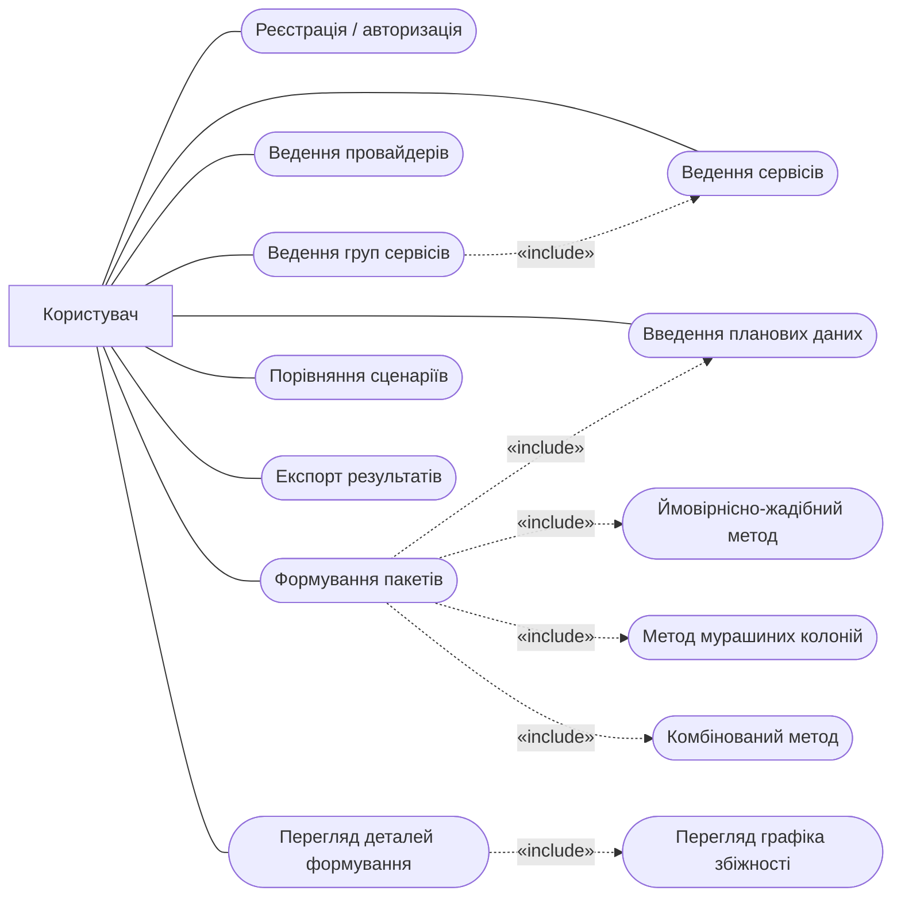
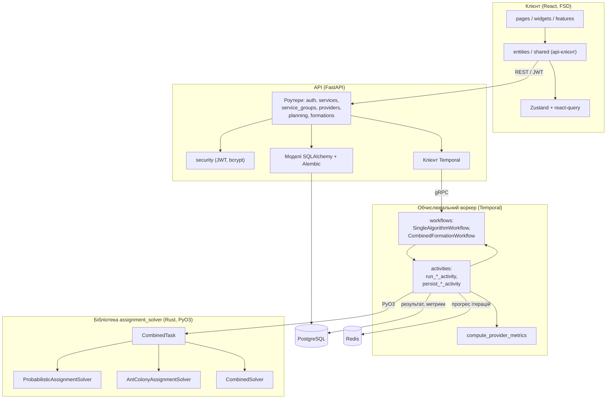
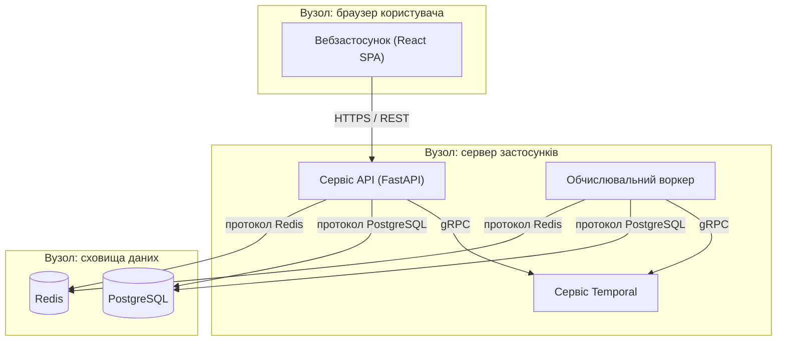
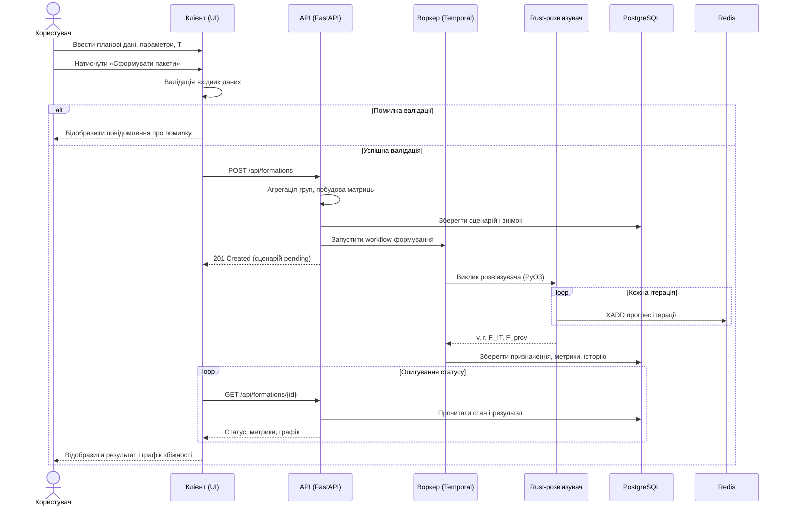

# Кресленики (конструкторські документи) — шифр ІС23.110БАК.005

> Ці чотири діаграми оформлюються **окремими аркушами формату А3** і **не
> вбудовуються** у пояснювальну записку. У тексті ПЗ на них наведено лише
> посилання за шифром. Тут зібрано вихідний код mermaid для рендерингу на
> кресленики (рамку та основний напис додає користувач вручну).

---

## ІС23.110БАК.005 Д1 — Діаграма варіантів використання

Mermaid не має нативної UML-форми use-case, тому актора зображено прямокутником
зліва, а варіанти використання — закругленими вузлами; пунктирні стрілки з
позначкою «include» — відношення включення.

---

## ІС23.110БАК.005 Д2 — Діаграма класів / компонентів

Компонентний склад монорепозиторію та напрям викликів і потоків даних: клієнт
(шари FSD) → API (роутери, моделі, безпека) → обчислювальний воркер (workflows,
activities) → Rust-бібліотека `assignment_solver` (три розв'язувачі); збоку —
PostgreSQL і Redis.

---

## ІС23.110БАК.005 Д3 — Діаграма розгортання

Фізичне розміщення компонентів за вузлами та протоколи з'єднання.

---

## ІС23.110БАК.005 Д4 — Діаграма послідовності

Сценарій формування пакетів сервісів: введення даних, валідація (гілка alt:
помилка / успіх), запуск робочого процесу, стрімінг ітерацій у Redis і збереження
у PostgreSQL.

