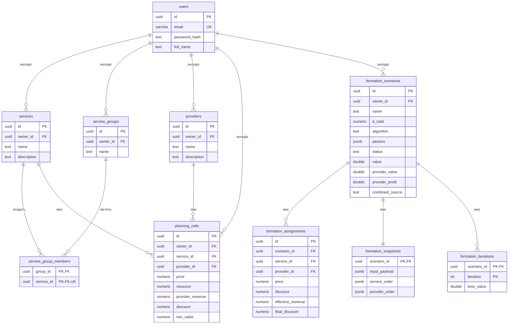
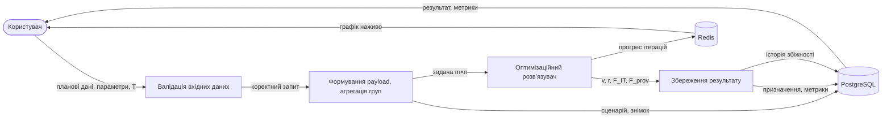

# 5 РОЗРОБКА ІНФОРМАЦІЙНОЇ СИСТЕМИ

## 5.1 Структура системи

Інформаційну систему формування пакетів сервісів реалізовано як розподілений
застосунок, організований у вигляді монорепозиторію. На відміну від класичної
трирівневої архітектури «клієнт – сервер – база даних», система додатково
виносить ресурсомісткі обчислення в окремий асинхронний обчислювальний контур,
а власне оптимізаційні алгоритми — у скомпільовану бібліотеку машинного коду.
Такий поділ зумовлений природою задачі: формування пакетів сервісів є
обчислювально складною комбінаторною задачею (розділ 6), і її виконання може
тривати від секунд до хвилин, тоді як інтерфейс прикладного програмування (API)
має лишатися чуйним і не блокувати HTTP-запити користувача на час обчислень.

Систему утворюють шість логічних складових.

**Клієнтська частина (Frontend).** Односторінковий вебзастосунок на бібліотеці
React із використанням мови TypeScript [11], зібраний інструментом Vite та
стилізований за допомогою Tailwind CSS і компонентної бібліотеки shadcn/ui.
Кодову базу структуровано за методологією Feature-Sliced Design — шари `app`,
`pages`, `widgets`, `features`, `entities`, `shared`, що впорядковує залежності
від загального до конкретного. Стан застосунку розділено за призначенням:
клієнтський стан автентифікації зберігається у сховищі Zustand
(`useAuthStore`), а серверні дані кешуються та синхронізуються бібліотекою
react-query. Клієнт спілкується із сервером виключно через REST-інтерфейс,
передаючи у заголовку запитів токен доступу.

**Серверна частина (Backend, API).** Реалізована мовою Python на асинхронному
вебфреймворку FastAPI [9]. Сервер надає REST-ендпойнти для керування каталогами
(сервіси, групи сервісів, провайдери), введення планових даних, запуску та
перегляду формувань. Доступ до прикладних ендпойнтів захищено механізмом
авторизації на основі токенів JWT (алгоритм підпису HS256), паролі зберігаються
у вигляді хешів bcrypt. API не виконує оптимізаційних обчислень самостійно — він
агрегує вхідні дані, фіксує сценарій у базі даних і запускає робочий процес
(workflow) в оркестраторі Temporal.

**Асинхронний обчислювальний воркер.** Окремий процес-воркер на основі Temporal
[13], написаний мовою Python. Він виконує визначені дії (activities) формування:
підготовку задачі, виклик оптимізаційного розв'язувача та збереження результату.
Під час виконання алгоритму воркер транслює прогрес ітерацій у Redis, завдяки
чому користувач бачить збіжність цільової функції в реальному часі. Винесення
обчислень у воркер забезпечує надійність (Temporal гарантує повторюваність і
відновлення робочих процесів після збоїв) та масштабованість (кількість воркерів
можна нарощувати незалежно від API).

**Бібліотека оптимізації.** Ядро математичного забезпечення — крейт `assignment_solver`
мовою Rust [10], скомпільований у нативний модуль розширення Python за допомогою
зв'язування PyO3 та збирача maturin. Бібліотека експортує модель задачі
(`CombinedTask`) і три розв'язувачі: `ProbabilisticAssignmentSolver` (ймовірнісно-
жадібний алгоритм), `AntColonyAssignmentSolver` (алгоритм мурашиних колоній) і
`CombinedSolver` (комбінований метод). Використання Rust дає продуктивність,
співмірну з C/C++, при безпечному паралелізмі — незалежні побудови розв'язків
виконуються паралельно засобами бібліотеки Rayon.

**База даних.** Реляційна СУБД PostgreSQL [12]. Доступ до неї здійснюється через
асинхронний ORM SQLAlchemy 2.0; схема супроводжується міграціями Alembic.
У базі даних зберігаються всі сутності користувача (каталоги, планові дані),
сценарії формування, їхні результати та історія збіжності.

**Redis.** Сховище даних у пам'яті, що використовується як канал трансляції
ітерацій під час виконання формування. Воркер записує прогрес у потік (stream)
Redis, а клієнт читає його — наживо під час виконання й через API після
завершення. Після збереження історії збіжності в PostgreSQL відповідний потік
вилучається.

Загальну будову системи — її акторів і варіанти використання, компонентний
склад, фізичне розгортання та взаємодію складових у часі — винесено у
конструкторські документи (кресленики), оскільки за вимогами кафедри ці діаграми
оформлюються окремими аркушами. У тексті пояснювальної записки на них наведено
лише посилання за шифром (підрозділи 5.2 та 5.5).

## Кресленики та рисунки

У цьому та наступному розділах розрізняються два види графічних матеріалів.
*Кресленики* — це формальні конструкторські документи, що оформлюються окремими
аркушами формату А3 і не вбудовуються у пояснювальну записку; у тексті на них
посилаються лише за шифром виробу. Систему супроводжують чотири кресленики із
шифром `ІС23.110БАК.005`: діаграма варіантів використання (Д1), діаграма
класів/компонентів (Д2), діаграма розгортання (Д3) та діаграма послідовності
(Д4). *Рисунки* — це ілюстрації, вбудовані безпосередньо у текст записки з
підписом «Рисунок X.Y». До рисунків належать схема бази даних, діаграма потоків
даних та схема стадій комбінованого методу.

## 5.2 Функціональна модель системи

Система розрахована на єдиний рівень доступу — усі зареєстровані користувачі
мають однаковий набір прав, поділу на ролі немає. Актором системи виступає
**користувач** — аналітик IT-компанії, що формує пакети сервісів для розміщення
у провайдерів інфокомунікацій. Кожен користувач працює з власним ізольованим
набором даних: створені ним сервіси, групи, провайдери, планові дані та сценарії
формування недоступні іншим користувачам.

Користувачеві доступні такі функції:

- реєстрація та авторизація в системі;
- ведення каталогу сервісів (створення, перегляд, редагування, видалення);
- ведення каталогу груп сервісів, об'єднання сервісів у неподільні групи
  (членство «усе або нічого»);
- ведення каталогу провайдерів;
- введення планових даних у вигляді п'яти матриць «сервіс × провайдер»:
  преференційна ціна, ресурс (трудомісткість), дохід провайдера, максимальна
  знижка та мінімальна відносна цінність s_ij;
- запуск формування пакетів одним із трьох методів — ймовірнісно-жадібним,
  мурашиних колоній або комбінованим — із заданням параметрів алгоритму та
  загального ресурсу T;
- перегляд деталей сформованого сценарію: метрик (дохід IT-компанії, дохід і
  прибуток провайдерів, створена цінність), графіка збіжності цільової функції
  та таблиці призначень «сервіс → провайдер»;
- порівняння кількох сценаріїв формування між собою;
- експорт результатів формування у форматах JSON та CSV.

Діаграму варіантів використання наведено у кресленику `ІС23.110БАК.005 Д1`.

## 5.3 Модель бази даних

Базу даних спроєктовано в реляційній моделі та нормалізовано. Кожна сутність,
що належить користувачеві, містить зовнішній ключ `owner_id` на таблицю `users`
із каскадним видаленням, тож усі дані користувача утворюють єдине дерево
володіння. Первинні ключі — універсальні унікальні ідентифікатори (UUID), що
генеруються на боці СУБД. Грошові й ресурсні величини зберігаються у типі
`NUMERIC` фіксованої точності, частки (знижки, пороги) — також у `NUMERIC` із
обмеженнями діапазону. Параметри алгоритму та заморожений вхідний стан сценарію
зберігаються у стовпцях типу `JSONB`.

Нижче описано всі таблиці схеми.

Таблиця 5.1 — Таблиця `users` (користувачі)

| Назва поля | Тип даних | Опис |
|---|---|---|
| id | UUID | Первинний ключ |
| email | VARCHAR(320) | Електронна пошта (унікальна), використовується як логін |
| password_hash | TEXT | Хеш пароля (bcrypt) |
| full_name | TEXT | Повне ім'я користувача (необов'язкове) |
| created_at | TIMESTAMPTZ | Час створення запису |
| updated_at | TIMESTAMPTZ | Час останнього оновлення запису |

Таблиця 5.2 — Таблиця `services` (сервіси)

| Назва поля | Тип даних | Опис |
|---|---|---|
| id | UUID | Первинний ключ |
| owner_id | UUID | Зовнішній ключ на `users` (власник) |
| name | TEXT | Назва сервісу (унікальна в межах власника) |
| description | TEXT | Опис сервісу (необов'язковий) |
| created_at | TIMESTAMPTZ | Час створення |
| updated_at | TIMESTAMPTZ | Час оновлення |

Таблиця 5.3 — Таблиця `service_groups` (групи сервісів)

| Назва поля | Тип даних | Опис |
|---|---|---|
| id | UUID | Первинний ключ |
| owner_id | UUID | Зовнішній ключ на `users` (власник) |
| name | TEXT | Назва групи (унікальна в межах власника) |
| created_at | TIMESTAMPTZ | Час створення |
| updated_at | TIMESTAMPTZ | Час оновлення |

Таблиця 5.4 — Таблиця `service_group_members` (членство сервісів у групах)

| Назва поля | Тип даних | Опис |
|---|---|---|
| group_id | UUID | Зовнішній ключ на `service_groups` (частина первинного ключа) |
| service_id | UUID | Зовнішній ключ на `services` (частина первинного ключа; унікальний) |

Унікальність стовпця `service_id` забезпечує, що кожен сервіс належить
щонайбільше одній групі. Це є технічною основою правила «усе або нічого»: під час
формування ціла група агрегується в одну логічну одиницю й призначається
провайдерові цілком або не призначається зовсім.

Таблиця 5.5 — Таблиця `providers` (провайдери)

| Назва поля | Тип даних | Опис |
|---|---|---|
| id | UUID | Первинний ключ |
| owner_id | UUID | Зовнішній ключ на `users` (власник) |
| name | TEXT | Назва провайдера (унікальна в межах власника) |
| description | TEXT | Опис провайдера (необов'язковий) |
| created_at | TIMESTAMPTZ | Час створення |
| updated_at | TIMESTAMPTZ | Час оновлення |

Таблиця 5.6 — Таблиця `planning_cells` (планові дані пари «сервіс–провайдер»)

| Назва поля | Тип даних | Опис |
|---|---|---|
| id | UUID | Первинний ключ |
| owner_id | UUID | Зовнішній ключ на `users` (власник) |
| service_id | UUID | Зовнішній ключ на `services` |
| provider_id | UUID | Зовнішній ключ на `providers` |
| price | NUMERIC(18,4) | Преференційна ціна d_ij |
| resource | NUMERIC(18,4) | Ресурс IT-компанії β_ij (трудомісткість) |
| provider_revenue | NUMERIC(18,4) | Дохід провайдера p_ij від кінцевих клієнтів |
| discount | NUMERIC(6,4) | Максимальна знижка r_max_ij (обмеження: 0 ≤ r < 1) |
| min_value | NUMERIC(8,4) | Мінімальна відносна цінність s_ij (обмеження: s ≥ 0) |
| created_at | TIMESTAMPTZ | Час створення |
| updated_at | TIMESTAMPTZ | Час оновлення |

Пара «сервіс–провайдер» унікальна (обмеження `uq_planning_service_provider`).
П'ять числових полів цієї таблиці утворюють п'ять планових матриць, що є вхідними
даними оптимізаційної задачі (розділ 6).

Таблиця 5.7 — Таблиця `formation_scenarios` (сценарії формування)

| Назва поля | Тип даних | Опис |
|---|---|---|
| id | UUID | Первинний ключ |
| owner_id | UUID | Зовнішній ключ на `users` (власник) |
| name | TEXT | Назва сценарію |
| b_total | NUMERIC(18,4) | Загальний ресурс IT-компанії T |
| algorithm | TEXT | Метод: `probabilistic`, `ant_colony` або `combined` |
| params | JSONB | Параметри обраного алгоритму |
| status | TEXT | Стан: `pending`, `running`, `completed`, `failed` |
| workflow_id | TEXT | Ідентифікатор робочого процесу Temporal |
| value | DOUBLE | Дохід IT-компанії F_IT |
| provider_value | DOUBLE | Дохід провайдерів F_prov |
| provider_profit | DOUBLE | Прибуток провайдерів |
| combined_source | TEXT | Переможний кандидат комбінованого методу (`subtask_a_improved` / `subtask_b_improved`) |
| finished_at | TIMESTAMPTZ | Час завершення |
| error | TEXT | Текст помилки (за невдалого виконання) |
| created_at | TIMESTAMPTZ | Час створення |
| updated_at | TIMESTAMPTZ | Час оновлення |

Поле `value` зберігає F_IT для всіх трьох методів; `provider_value` і
`provider_profit` обчислюються та зберігаються теж для всіх методів;
`combined_source` заповнює лише комбінований метод.

Таблиця 5.8 — Таблиця `formation_assignments` (призначення сервісів)

| Назва поля | Тип даних | Опис |
|---|---|---|
| id | UUID | Первинний ключ |
| scenario_id | UUID | Зовнішній ключ на `formation_scenarios` |
| service_id | UUID | Зовнішній ключ на `services` |
| provider_id | UUID | Зовнішній ключ на `providers` |
| price | NUMERIC(18,4) | Преференційна ціна сервісу на момент формування |
| discount | NUMERIC(6,4) | Планова знижка (для довідки) |
| effective_revenue | NUMERIC(18,4) | Фактичний дохід IT-компанії від пари: (1 − r)·price |
| final_discount | NUMERIC(6,4) | Фактично застосована знижка (узгоджена — для комбінованого методу) |

Один рядок відповідає одному призначеному сервісу (v_ij = 1). Числові значення
заморожуються на момент виконання, тож результат лишається відтворюваним навіть
після зміни планових даних.

Таблиця 5.9 — Таблиця `formation_iterations` (історія збіжності)

| Назва поля | Тип даних | Опис |
|---|---|---|
| scenario_id | UUID | Зовнішній ключ на `formation_scenarios` (частина первинного ключа) |
| iteration | INTEGER | Номер ітерації (частина первинного ключа) |
| best_value | DOUBLE | Найкраще значення цільової функції на цій ітерації |

Таблиця 5.10 — Таблиця `formation_snapshots` (заморожений вхід сценарію)

| Назва поля | Тип даних | Опис |
|---|---|---|
| scenario_id | UUID | Зовнішній ключ на `formation_scenarios` (первинний ключ) |
| input_payload | JSONB | Повний вхідний payload (агреговані матриці та по-сервісні вектори) |
| service_order | JSONB | Упорядкований перелік логічних одиниць (груп та поодиноких сервісів) |
| provider_order | JSONB | Упорядкований перелік ідентифікаторів провайдерів |

Знімок (snapshot) фіксує повний вхідний стан задачі на момент запуску. Це
забезпечує відтворюваність: результат можна повторно розгорнути у по-сервісні
призначення, не звертаючись до поточного (можливо, зміненого) каталогу.

Схему бази даних із усіма таблицями, ключами та зв'язками наведено на
рисунку 5.1.

Рисунок 5.1 — Схема бази даних (ER-діаграма)

Стовпці типу `JSONB` застосовано там, де структура даних є змінною або
напівструктурованою. У `formation_scenarios.params` зберігаються параметри
конкретного алгоритму (набір полів залежить від методу), а у
`formation_snapshots.input_payload` — повний вхідний payload із усіма матрицями,
що дозволяє відтворити обчислення без звернення до поточного каталогу.

## 5.4 Передавання та обробка даних

**Вхідними даними** формування є: каталоги сервісів, груп і провайдерів; п'ять
планових матриць (ціна d_ij, ресурс β_ij, дохід провайдера p_ij, максимальна
знижка r_max_ij, мінімальна відносна цінність s_ij); обраний метод і його
параметри; загальний ресурс IT-компанії T.

**Вихідними даними** є: бінарна матриця призначень v_ij; матриця узгоджених
знижок r_ij (для комбінованого методу); дохід IT-компанії F_IT; дохід
провайдерів F_prov; прибуток провайдерів; створена цінність; історія збіжності
цільової функції; експорт результату у форматах JSON і CSV.

Потік обробки даних має такий вигляд. Клієнт виконує первинну валідацію введених
даних і надсилає POST-запит на API. Сервер завантажує з бази збережені сутності,
агрегує групи сервісів у логічні одиниці й будує агреговані матриці «одиниця ×
провайдер», створює запис сценарію та його знімок (snapshot), після чого запускає
відповідний робочий процес Temporal (`SingleAlgorithmWorkflow` для ймовірнісно-
жадібного й мурашиних колоній, `CombinedFormationWorkflow` для комбінованого).
Воркер у дії виконання викликає Rust-розв'язувач, який під час роботи транслює
прогрес кожної ітерації у потік Redis. Після завершення розв'язувача дія
збереження записує у PostgreSQL призначення (розгорнуті по сервісах), метрики
сценарію та дреновану з Redis історію збіжності, а статус сценарію переводиться у
`completed`. Клієнт під час виконання опитує статус сценарію і відображає графік
збіжності наживо, а після завершення — підсумкові метрики й таблицю призначень.

Діаграму потоків даних наведено на рисунку 5.2.

Рисунок 5.2 — Діаграма потоків даних (DFD)

## 5.5 Архітектура програмного забезпечення

Оскільки серверна частина системи побудована не на класичній об'єктно-
орієнтованій ієрархії класів, а на взаємодії слабко зв'язаних модулів і служб,
архітектуру програмного забезпечення доцільно описати у термінах компонентів.
Систему утворюють чотири основні програмні компоненти — клієнт, API, воркер і
бібліотека оптимізації — та дві служби зберігання (PostgreSQL і Redis), що
взаємодіють через чітко визначені інтерфейси (REST, gRPC Temporal, протокол
PostgreSQL, протокол Redis, виклики PyO3). Компонентну будову системи наведено у
кресленику `ІС23.110БАК.005 Д2`.

Нижче специфіковано ключові програмні модулі та функції системи. Бібліотеку
оптимізації описано на рівні класів-розв'язувачів і їхніх методів (таблиця 5.11),
обчислювальний воркер — на рівні дій Temporal (таблиця 5.12).

Таблиця 5.11 — Специфікація розв'язувачів бібліотеки `assignment_solver` (Rust)

| Назва | Опис | Вхідні параметри | Вихідні параметри |
|---|---|---|---|
| `CombinedTask` | Єдина модель задачі для всіх трьох методів; перевіряє коректність матриць і реалізує предикат допустимості (4) | m, n, c (d_ij), b_ij (β_ij), p_ij, omega_max (r_max), s_ij, b_total (T) | Об'єкт задачі |
| `ProbabilisticAssignmentSolver.solve` | Ймовірнісно-жадібний алгоритм підзадачі А; найкращий із `kmax` випадкових побудов | задача `CombinedTask` | Матриця v, значення F_IT |
| `AntColonyAssignmentSolver.solve` | Алгоритм мурашиних колоній для підзадачі А | задача `CombinedTask` | Матриця v, значення F_IT |
| `CombinedSolver.solve` | Комбінований метод (4 стадії): підзадачі А і Б, крос-оцінка, локальний пошук, вибір кандидата | задача `CombinedTask` | v, r, F_IT, F_prov, source |
| `set_iteration_callback` | Реєструє callback для трансляції прогресу ітерацій | функція зворотного виклику | — |
| `heuristic` | Цінність одиниці ресурсу θ_ij = d_ij·(1 − r_ij)/β_ij | c, b_ij, omega | Матриця θ |
| `objective` / `weighted_objective` | Цільова функція IT-компанії ΣΣ(1 − r_ij)·d_ij·v_ij | v, c, omega | F_IT |
| `provider_objective` | Дохід провайдерів ΣΣ p_ij·v_ij | v, p | F_prov |
| `is_admissible` | Перевірка обмеження (4): s·(1 − r)·d ≤ p | s, r, d, p | Булеве значення |

Таблиця 5.12 — Специфікація дій (activities) обчислювального воркера

| Назва | Опис | Вхідні параметри | Вихідні параметри |
|---|---|---|---|
| `run_algorithm_activity` | Запуск ймовірнісно-жадібного або мурашиних колоній; трансляція ітерацій у Redis | `RunAlgorithmInput` (матриці, параметри, канал Redis) | `RunResult` (v, F, час) |
| `run_combined_method_activity` | Запуск комбінованого методу на агрегованих матрицях | `CombinedSolveInput` | `CombinedResult` (v, r, F_IT, F_prov, source) |
| `persist_formation_result_activity` | Запис результату у PostgreSQL: розгортання v у по-сервісні призначення, метрики, історія | `PersistFormationInput` | — |
| `persist_combined_result_activity` | Запис результату комбінованого методу (зокрема узгоджених знижок r) | `PersistCombinedInput` | — |
| `compute_provider_metrics` | Обчислення метрик провайдерів (F_prov, прибуток, створена цінність) зі знімка | service_cells, unit_order, v, final_discount | (F_prov, прибуток, цінність) |

Динаміку взаємодії компонентів у часі — від введення даних користувачем до
відображення результату, з гілкою валідації, стрімінгом ітерацій у Redis і
збереженням у PostgreSQL — наведено у кресленику `ІС23.110БАК.005 Д4` (діаграма
послідовності). Фізичне розгортання компонентів за вузлами (браузер користувача,
сервер з API та воркером, служби Temporal, PostgreSQL і Redis) із зазначенням
протоколів з'єднання (HTTP, gRPC, протоколи PostgreSQL і Redis) наведено у
кресленику `ІС23.110БАК.005 Д3` (діаграма розгортання).

## Висновки до розділу 5

У розділі розроблено інформаційну систему формування пакетів сервісів як
розподілений застосунок із чітким поділом відповідальності. Обґрунтовано
винесення ресурсомістких обчислень в асинхронний воркер на базі Temporal та в
скомпільовану Rust-бібліотеку, що забезпечує чуйність API й масштабованість
обчислень. Спроєктовано та нормалізовано реляційну базу даних із десяти таблиць,
що покриває каталоги, планові дані, сценарії формування, їхні результати та
історію збіжності; для змінних і напівструктурованих даних застосовано тип
`JSONB`. Описано потоки передавання й обробки даних — від валідації на клієнті до
збереження результату в PostgreSQL із трансляцією прогресу через Redis.
Специфіковано ключові програмні компоненти: три Rust-розв'язувачі, дії
обчислювального воркера та допоміжні функції обчислення метрик. Архітектурні
діаграми (варіантів використання, класів/компонентів, розгортання та
послідовності) оформлено окремими креслениками із шифром `ІС23.110БАК.005`.
