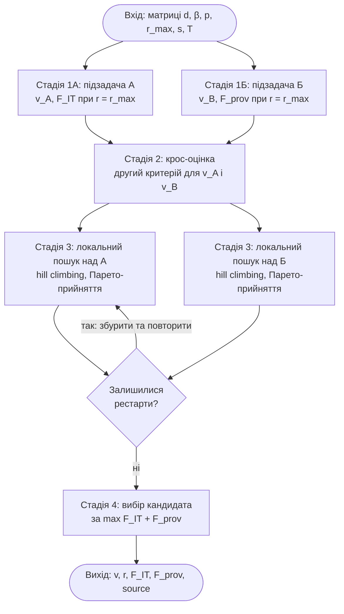

# 6 МАТЕМАТИЧНЕ ЗАБЕЗПЕЧЕННЯ

## 6.1 Змістовна постановка задачі

IT-компанія розробляє програмні сервіси й прагне розмістити їх у провайдерів
інфокомунікацій, які перепродають ці сервіси своїм кінцевим клієнтам. Завдання
полягає у формуванні пакетів сервісів — у визначенні того, які сервіси яким
провайдерам доцільно запропонувати, та на яких умовах знижки [4].

Сервіси можуть бути об'єднані у групи. Група є неподільною логічною одиницею:
вона призначається провайдерові цілком або не призначається зовсім (правило «усе
або нічого»). Для кожної пари «сервіс (одиниця) – провайдер» задано: преференційну
ціну, за якою IT-компанія готова надати сервіс; ресурс (трудомісткість), потрібний
IT-компанії для надання сервісу; дохід, який провайдер очікує отримати від своїх
клієнтів; максимально допустиму знижку; мінімальну відносну цінність, нижче за яку
співпраця для провайдера втрачає сенс. Сукупний ресурс IT-компанії обмежений.

Особливість задачі в тому, що інтереси сторін різноспрямовані. IT-компанія
зацікавлена максимізувати власний дохід (а отже, давати менші знижки), тоді як
провайдер погоджується брати сервіс лише тоді, коли його власний дохід достатньо
перевищує те, що він сплачує IT-компанії. Інструментом узгодження інтересів є
**система знижок**: зменшуючи ціну сервісу, IT-компанія робить його прийнятним для
провайдера. Тому метою є формування **взаємовигідних** пакетів — компромісу
інтересів IT-компанії та провайдерів, а не розв'язку, оптимального лише для однієї
сторони [4]. Такий підхід продовжує лінію досліджень формування пакетів сервісів
на основі статистичної інформації [2] та алгоритмів кластеризації [3] і
ґрунтується на платформній моделі життєвого циклу сервісів провайдерів
інфокомунікацій [7].

## 6.2 Математична постановка задачі

Нехай задано m логічних одиниць (окремих сервісів або груп сервісів IT-компанії)
та n провайдерів інфокомунікацій. Вхідними даними є матриці розмірності m × n:

- d_ij — преференційна ціна одиниці i для провайдера j;
- β_ij — обсяг ресурсу IT-компанії, потрібний для надання одиниці i провайдерові j;
- p_ij — дохід провайдера j від перепродажу одиниці i власним кінцевим клієнтам;
- r_max_ij — максимально допустима знижка на ціну, r_max_ij ∈ [0, 1);
- s_ij — мінімальна відносна цінність (поріг прийнятності) для провайдера, s_ij ≥ 0;

та скаляр T — загальний ресурс IT-компанії.

**Змінними задачі** є:

- v_ij ∈ {0, 1} — булева змінна призначення: v_ij = 1, якщо одиницю i включено у
  пакет провайдера j, інакше 0;
- r_ij ∈ [0, r_max_ij] — фактична знижка на ціну одиниці i для провайдера j; у
  комбінованому методі знижка є повноцінною змінною оптимізації, у двох інших
  методах фіксується на плановому рівні.

**Обмеження.** Сумарний ресурс IT-компанії, витрачений на всі призначені одиниці,
не може перевищувати наявного:

    ΣᵢΣⱼ β_ij · v_ij ≤ T.                                    (3)

Кожна призначена пара має задовольняти умову відносної цінності для провайдера:

    s_ij · (1 − r_ij) · d_ij ≤ p_ij.                         (4)

Економічний зміст обмеження (4): дохід провайдера p_ij має бути щонайменше у s_ij
разів більшим за те, що провайдер сплачує IT-компанії за сервіс, тобто за ціну
після знижки (1 − r_ij)·d_ij. При s_ij = 0 обмеження виконується завжди (пара
допустима за будь-якої знижки). Знижка входить у (4) через знаменник вартості:
підвищення r_ij знижує (1 − r_ij)·d_ij і полегшує виконання умови — саме це робить
знижку важелем поступок. Множникова (а не дробова) форма запису коректно обробляє
випадок безкоштовного сервісу d_ij = 0, для якого умова 0 ≤ p_ij є тотожно
істинною.

**Цільові функції.** Задача є двокритеріальною. Перший критерій (підзадача А)
відображає інтерес IT-компанії — максимізацію її сумарного доходу від наданих
сервісів з урахуванням знижок:

    F_IT = ΣᵢΣⱼ (1 − r_ij) · d_ij · v_ij  →  max.            (1)

Другий критерій (підзадача Б) відображає інтерес провайдерів — максимізацію їхнього
сумарного доходу від кінцевих клієнтів:

    F_prov = ΣᵢΣⱼ p_ij · v_ij  →  max.                        (2)

Прибуток провайдерів визначається як різниця між їхнім доходом і тим, що вони
сплачують IT-компанії:

    Π_prov = ΣᵢΣⱼ (p_ij − (1 − r_ij)·d_ij) · v_ij.

Оскільки (1 − r_ij)·d_ij — це водночас подохідний внесок IT-компанії за пару,
виконується точна тотожність створеної цінності:

    F_IT + Π_prov = ΣᵢΣⱼ p_ij · v_ij = F_prov,

тобто сумарна створена цінність не залежить від знижки й дорівнює F_prov; знижка
лише перерозподіляє цю цінність між IT-компанією та провайдером.

За своєю структурою задача є **двокритеріальною задачею булевого (0–1)
програмування** з ресурсним обмеженням. За наявності єдиного ресурсного обмеження
вона належить до класу задач про рюкзак, а у формулюванні «призначення одиниць
провайдерам» — до задач про призначення; обидва класи є NP-складними [17].

**Свідомі відхилення від буквального тексту статті [4].** Реалізована модель
містить три обґрунтовані уточнення вихідної моделі. По-перше, дохід провайдерів
взято у вигляді F_prov = Σ p_ij·v_ij (сирий, без множника (1 − r)), а не за
буквальною формулою (2) статті Σ(1 − r)·p·v. Підставою є те, що p_ij — це дохід
провайдера від його **власних кінцевих клієнтів**, який не залежить від знижки
IT-компанії: знижка r змінює лише суму (1 − r)·d, яку провайдер сплачує
IT-компанії, а не його клієнтський дохід. По-друге, обмеження відносної цінності
(4) застосовується не лише в комбінованому методі, а в усіх трьох методах (для
ймовірнісно-жадібного й мурашиних колоній — при плановій знижці), щоб усі методи
поважали прибутковість провайдера й були порівнянними за однакових обмежень.
По-третє, знижка r_ij трактується як повноцінна змінна оптимізації в діапазоні
[0, r_max_ij], а не як наперед задана константа. Через останнє уточнення наївна
оцінка «F_IT комбінованого методу ≤ F_IT підзадачі А при r_max» не виконується й
не повинна: опускання знижки підвищує (1 − r)·d, тож комбінований метод за окремих
структур здатний дати більший F_IT.

## 6.3 Обґрунтування методу розв'язання

Для розв'язання сформульованої задачі теоретично можливі кілька груп методів.
**Точні методи** (повний перебір, метод гілок і меж, динамічне програмування)
гарантують глобальний оптимум, проте для NP-складних задач про рюкзак і
призначення їхня обчислювальна складність зростає експоненційно з розмірністю
[17], тому для практичних розмірів матриці «одиниці × провайдери» повний перебір
непридатний. **Евристичні методи** (зокрема жадібні) дають прийнятний розв'язок
швидко, але можуть «застрягати» в локальних екстремумах. **Метаевристичні методи**
(мурашині алгоритми, генетичні алгоритми, локальний пошук) поєднують
спрямованість пошуку з механізмами уникання локальних екстремумів і добре
зарекомендували себе на комбінаторних задачах великої розмірності [8; 16].

З огляду на двокритеріальність і велику розмірність задачі обрано три методи, що
доповнюють один одного:

- **ймовірнісно-жадібний алгоритм** — швидкий конструктивний метод, що поєднує
  жадібний вибір із випадковістю; застосовується для розв'язання однокритеріальних
  підзадач;
- **алгоритм мурашиних колоній (АМК)** — метаевристика, що накопичує «досвід»
  попередніх побудов у вигляді феромонного сліду [8];
- **комбінований метод** — головний внесок роботи; він інтегрує однокритеріальні
  підзадачі А і Б та покращує їх локальним пошуком над парою (призначення, знижки),
  знаходячи взаємовигідний компроміс [4].

Двокритеріальність розв'язується не зведенням до одного критерію через вагові
коефіцієнти, а на основі поняття **Парето-домінування** [18]: розв'язок
вважається кращим, лише якщо він не гірший за обома критеріями й строго кращий
хоча б за одним.

## 6.4 Опис методів розв'язання

### 6.4.1 Ймовірнісно-жадібний алгоритм

Алгоритм розв'язує підзадачу А — максимізує дохід IT-компанії F_IT за обмеженнями
(3) і (4). Для кожної пари «одиниця–провайдер» обчислюється цінність одиниці
ресурсу θ_ij = d_ij·(1 − r_ij)/β_ij. Розв'язок будується покроково: на кожному
кроці зі множини допустимих пар (ще не призначених, що вкладаються у залишок
ресурсу й задовольняють (4)) випадково обирається одна з імовірністю, пропорційною
її цінності θ_ij. Поєднання жадібного принципу (перевага парам із вищою цінністю)
з випадковістю дозволяє уникати локальних екстремумів. Побудову повторюють K_max
разів, серед усіх розв'язків обирають найкращий.

Псевдокод алгоритму:

```
Крок 1. Обчислити матрицю цінностей θ_ij = d_ij·(1 − r_ij)/β_ij.
Крок 2. F_best ← 0; v_best ← 0.
Крок 3. Повторити K_max разів:
          3.1. v ← 0; t ← 0 (використаний ресурс).
          3.2. Сформувати множину допустимих пар A:
               v_ij = 0, t + β_ij ≤ T, s_ij·(1 − r_ij)·d_ij ≤ p_ij, θ_ij > 0.
          3.3. Якщо A порожня — перейти до кроку 3.5.
          3.4. Обрати пару (i, j) з A з імовірністю ∝ θ_ij;
               v_ij ← 1; t ← t + β_ij; повернутися до 3.2.
          3.5. Обчислити F = ΣΣ (1 − r_ij)·d_ij·v_ij.
          3.6. Якщо F > F_best, то F_best ← F; v_best ← v.
Крок 4. Повернути (v_best, F_best).
```

### 6.4.2 Алгоритм мурашиних колоній

На відміну від ймовірнісно-жадібного алгоритму, де цінність пар статична, в АМК
кожна пара «одиниця–провайдер» має ще й рівень феромону τ_ij, що змінюється з
ітераціями [8]. На кожній ітерації L мурашок незалежно будують свої пакети,
обираючи допустиму пару (i, j) з імовірністю, пропорційною τ_ij^α · θ_ij^β, де
α — відносна важливість феромонного сліду, β — відносна важливість цінності пари
(привабливості). Після ітерації виконується випаровування феромону (τ_ij ←
(1 − ρ)·τ_ij) та його підсилення на парах, що увійшли у розв'язки мурашок
(τ_ij ← τ_ij + F_l/Q, де Q — нормуючий коефіцієнт). Параметри алгоритму: L —
кількість мурашок, K_max — кількість ітерацій, α, β, ρ — коефіцієнт випаровування,
τ₀ — початковий рівень феромону.

Псевдокод алгоритму:

```
Крок 1. Обчислити θ_ij = d_ij·(1 − r_ij)/β_ij; ініціалізувати τ_ij ← τ₀.
Крок 2. Обчислити нормуючий коефіцієнт Q = T·d_max / β̄.
Крок 3. F_best ← 0; v_best ← 0.
Крок 4. Повторити K_max разів:
          4.1. Обчислити ваги вибору score_ij = τ_ij^α · θ_ij^β.
          4.2. Для кожної з L мурашок незалежно побудувати розв'язок v_l
               (ймовірнісний вибір допустимих пар ∝ score_ij, з перевіркою (3) і (4))
               та обчислити F_l = ΣΣ (1 − r_ij)·d_ij·v_l,ij.
          4.3. Оновити рекорд: якщо F_l > F_best, то F_best ← F_l; v_best ← v_l.
          4.4. Випаровування: τ_ij ← (1 − ρ)·τ_ij.
          4.5. Підсилення: для кожної мурашки l і кожної пари (i, j) з v_l,ij = 1
               додати τ_ij ← τ_ij + F_l / Q.
Крок 5. Повернути (v_best, F_best).
```

### 6.4.3 Комбінований метод

Комбінований метод є головним методом роботи. Він інтегрує дві однокритеріальні
підзадачі — IT-компанії (А) і провайдерів (Б) — і знаходить взаємовигідний пакет:
не оптимальний для жодної зі сторін окремо, але максимальний за **сумарною
вигодою** F_IT + F_prov [4]. Метод складається з чотирьох стадій.

**Стадія 1.** Окремо розв'язуються підзадача А (ймовірнісно-жадібним алгоритмом,
максимізуючи F_IT) і підзадача Б (максимізуючи F_prov), обидві при знижках на рівні
максимуму r = r_max, з урахуванням обмежень (3) і (4). У підзадачі Б евристикою є
дохід провайдера на одиницю ресурсу p_ij/β_ij, а побудова виконується по
провайдерах. Результат стадії — два розв'язки: v_A та v_B.

**Стадія 2.** Виконується крос-оцінка: для розв'язку v_A додатково обчислюється
другий критерій F_prov, а для v_B — перший критерій F_IT. Це дає для кожного
кандидата повну пару метрик (F_IT, F_prov).

**Стадія 3.** Над кожним кандидатом виконується локальний пошук методом
підйому до вершини (hill climbing) зі стратегією найкращого покращення
(best-improvement) і Парето-критерієм прийняття [16; 18]. Тут знижки r стають
змінними рішення. Сусідство поточного стану (v, r) утворюють чотири типи ходів:
(1) додати пару (v: 0 → 1), якщо вистачає ресурсу й пара допустима; (2) прибрати
пару (v: 1 → 0); (3) зменшити знижку на включеній парі на крок (r ← r − step) —
менша знижка підвищує (1 − r), а отже F_IT цієї пари, при незмінному F_prov, тож
це чистий Парето-кращий хід; (4) збільшити знижку на крок (r ← r + step), що має
сенс лише у складеному ході глибини 2 — підняти знижку на одній парі, щоб зробити
допустимою й додати іншу, раніше недопустиму пару. Хід приймається за Парето-
критерієм: F_IT' ≥ F_IT **і** F_prov' ≥ F_prov, строго хоча б за одним критерієм;
серед прийнятних обирається хід із найбільшим приростом сумарної вигоди. Для
розширення області пошуку передбачено збурені рестарти (випадкове перемикання
частини пар із подальшим відновленням допустимості).

**Стадія 4.** З двох покращених кандидатів (А′ і Б′) обирається той, що має більшу
сумарну вигоду F_IT + F_prov; ознака переможця зберігається у полі `combined_source`.

Ключову роль відіграє знак зміни знижки. Оскільки F_prov не залежить від r,
зменшення знижки на включеній парі є чистим приростом доходу IT-компанії при
незмінному доході провайдера (Парето-крок), а обмеження (4) при цьому лише
полегшується. Збільшення знижки — навпаки, поступка IT-компанії, що знижує її
дохід, але може зробити допустимою раніше неприйнятну для провайдера пару; саме це
й реалізує обмеження (4) як важіль взаємних поступок. Схему стадій комбінованого
методу наведено на рисунку 6.1.



Рисунок 6.1 — Схема стадій комбінованого методу

Псевдокод комбінованого методу:

```
Крок 1. (Стадія 1) Розв'язати підзадачу А: (v_A, F_IT_A) при r = r_max.
        Розв'язати підзадачу Б: (v_B, F_prov_B) при r = r_max.
Крок 2. (Стадія 2) Сформувати стани:
        S_A = (v_A, r_max, F_IT_A, F_prov(v_A));
        S_B = (v_B, r_max, F_IT(v_B), F_prov_B).
Крок 3. (Стадія 3) Для кожного стану S ∈ {S_A, S_B}:
          3.1. поточний ← S; best ← S.
          3.2. Повторити для кожного рестарту (включно з основним прогоном):
                 а) поточний ← старт (основний прогін) або збурений(старт);
                 б) Поки існує прийнятний хід:
                      - згенерувати сусідство (додати/прибрати пару, ±step знижки,
                        складені ходи глибини 2);
                      - відфільтрувати допустимі (за (3), (4)) та Парето-кращі ходи;
                      - якщо їх немає — локальний оптимум, вийти з циклу;
                      - перейти до ходу з найбільшим приростом F_IT + F_prov.
                 в) якщо F_IT + F_prov поточного > best, то best ← поточний.
          3.3. Покращений кандидат S′ ← best.
Крок 4. (Стадія 4) Обрати кандидата S′ із більшим F_IT + F_prov; визначити source.
Крок 5. Повернути (v, r, F_IT, F_prov, source) обраного кандидата.
```

## Висновки до розділу 6

У розділі сформульовано та формалізовано задачу формування взаємовигідних пакетів
сервісів для провайдерів інфокомунікацій. Побудовано математичну модель:
визначено вхідні дані (п'ять матриць та обмеження ресурсу), змінні (булеві
призначення та знижки), обмеження ресурсу (3) і відносної цінності (4) та дві
цільові функції — доходу IT-компанії F_IT і доходу провайдерів F_prov; доведено
тотожність створеної цінності F_IT + Π_prov = F_prov. Задачу класифіковано як
двокритеріальну задачу булевого програмування типу про рюкзак / призначення
(NP-складну), для якої обґрунтовано доцільність евристичних і метаевристичних
методів. Описано три методи розв'язання з псевдокодом: ймовірнісно-жадібний,
мурашиних колоній і комбінований. Підкреслено, що саме комбінований метод, який
інтегрує однокритеріальні підзадачі та виконує локальний пошук над знижками за
Парето-критерієм, здатний знайти взаємовигідний компроміс інтересів IT-компанії та
провайдерів — результат, недосяжний для однокритеріальних методів.
